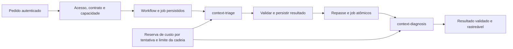

# Fase 1 — execução especializada e comunicação durável

Data: 08/10/2026. Base: `40bb8e5`, branch `feat/visual-system-v2`.

Implementação local da fase 1 do [plano de agentes](ai-agents-roadmap-2026-10-07.md). Contrato registrado no [capítulo oficial Agentes e ferramentas](https://app.notion.com/p/3c7e18aa7b0d81cba5c3d6e7cce87585), seção 13.3. A rotina nova começa desativada. Não houve chamada a modelo externo durante a implementação e os testes.

## Comportamento entregue

O supervisor admite uma análise de uma oportunidade ARES e de seu snapshot existente. Cria um workflow e um job PostgreSQL, executa `context-triage`, valida a saída e agenda `context-diagnosis` com o resultado anterior e o mesmo snapshot. A segunda etapa encerra a cadeia. Cada agente tem identidade, objetivo, instruções, schemas, hash, modelos permitidos e limites separados. O supervisor define os destinos; o modelo não delega, não executa SQL, não acessa memória e não altera o CRM.

`agent_runs`, `model_usage`, ledger e reservas existentes continuam sendo a contabilidade oficial. Workflows e repasses acrescentam raiz, pai, profundidade, correlação, definição e checkpoints. Um mesmo pedido idempotente retorna a mesma cadeia; mudar seu conteúdo mantendo a chave gera conflito.

O worker existente consome os novos jobs com lease, heartbeat e token de fencing. Reserva uma oportunidade de processamento por tick antes dos jobs antigos para evitar que uma fila cheia impeça a cadeia de avançar. O lock global do TickWorker permanece: ele processa uma tentativa por tick. O runtime admite workers concorrentes e impõe um teto por empresa, sem depender de contador em memória; esta fase não cria um pool paralelo de processamento.

## Segurança e controles

- Empresa, plano Connect, cobrança, vínculo ativo, papel, carteira e capacidade são consultados no banco. O papel enviado no cliente não concede acesso.
- As verificações se repetem antes do envio e antes da publicação/repasse. Revogação durante uma chamada impede publicar a resposta e agendar a próxima etapa; consumo medido continua registrado.
- Usuário não pode escolher empresa, credenciais, modelo, fatos, ferramentas ou agente de destino no pedido.
- Administrador configura a rotina com versão esperada e justificativa auditada. Auditor não executa análises; vendedor fica restrito à própria carteira. Histórico de workflow exige a empresa, o autor e acesso atual à oportunidade.
- As três novas tabelas têm RLS e nenhum grant de leitura/escrita para `anon` ou `authenticated`. A API é o caminho de acesso e retorna `Cache-Control: no-store`.
- Citações da saída precisam pertencer às evidências fornecidas. Texto gerado continua sendo interpretação, não prova factual ou aprovação de ação.
- Sem chave do modelo, a cadeia termina explicitamente em modo degradado, sem chamada externa nem consumo fictício.

## Limites iniciais

| Controle | Padrão implementado |
| --- | --- |
| Rotina | `context-analysis.v1`; sequência fixa com dois agentes |
| Capacidades | Legado follow-up/triagem ocupa a primeira rotina; a nova análise ocupa a segunda, com seus dois agentes visíveis no catálogo |
| Ativação | Desativada por padrão; exige `agent_slots >= 2`, contrato válido e administrador |
| Fila | Até 20 workflows ativos por empresa |
| Concorrência | Até 2 leases ativos por empresa; `ARES_AGENT_MAX_CONCURRENT_PER_TENANT`, válido de 1 a 16 |
| Lease e heartbeat | Lease de 30 s; renovação a cada 5 s; lease expirado não pode ser ressuscitado |
| Timeout | Até 95 s por tentativa; 5 min para a cadeia, incluindo espera na fila |
| Tentativas | Até 2 claims por etapa; no máximo 4 runs por cadeia; recuperação automática apenas antes do envio |
| Delegação | Jobs limitam profundidade até 3; catálogo só permite profundidades 0 e 1, nessa ordem e sem ciclo |
| Contexto | Snapshot mais recente da oportunidade; projeção conservadora existente; envelope serializado até 16.000 bytes |
| Saída | Schema `analysis-output.v1`; resumo até 1.200 caracteres, 20 referências e 8 limitações |
| Orçamento | Reserva individual pelo guard existente; teto da cadeia calculado no servidor a partir de duas estimativas máximas, modelo e envelope |

O limite por bytes não é apresentado como equivalente ao contrato de 2.500 tokens. Unificar os blocos e a medição do Context Builder pertence à fase 2. Ter o snapshot mais recente salvo também não garante que o CRM esteja sincronizado neste instante.

## APIs e operação

Todas usam autenticação, rate limit de usuário/empresa existente e autorização persistida.

| Método e rota | Uso |
| --- | --- |
| `GET /api/v1/agents/catalog` | Rotinas, agentes, definições e capacidades; admin, gestor ou auditor |
| `PUT /api/v1/agents/routines/context-analysis` | Ativar/desativar; `{enabled, expected_version, reason}`; somente admin |
| `POST /api/v1/agents/workflows` | Criar; `{opportunity_id, context_ref, idempotency_key, purpose: "context_analysis"}`; recibo HTTP 202 |
| `GET /api/v1/agents/workflows/{id}` | Estado, runs e repasses da cadeia do autor |
| `POST /api/v1/agents/workflows/{id}/cancel` | Cancelar a própria cadeia; operação idempotente |

Consultar primeiro o catálogo e sua versão atual. Um registro ausente usa `expected_version: 0`; versões posteriores devem usar o valor retornado. O contexto e a oportunidade devem ser os IDs reais já publicados pelo backend, não texto livre. Após o HTTP 202, o worker supervisionado processa a fila; consultar a rota do workflow para acompanhar. Nenhuma interface de configuração foi adicionada nesta fase de infraestrutura.

### Reinício, cancelamento e custo incerto

`prepared` identifica tentativa ainda não enviada: recuperar lease expirado pode liberar a reserva e reagendar dentro do limite. `dispatched` significa que o envio pode ter ocorrido: se a resposta se perder, o workflow termina com `agent_model_result_unknown` e não reenvia automaticamente. A reserva fica conservadoramente retida; não contabilizar gasto zero por falta de recibo.

Cancelar bloqueia a publicação e repasses futuros; não promete desfazer uma chamada já aceita pelo provedor. Quando seu consumo chegar, será registrado. Para resultado incerto, o operador deve conferir run, checkpoint, reserva e recibo do provedor antes de qualquer conciliação. Esta fase não oferece botão para liberar reservas desconhecidas nem reexecução automática. Uma nova análise consciente exige nova chave idempotente e orçamento disponível.

## Banco e publicação

Migration: `supabase/migrations/20261007190000_agent_execution_foundation.sql`. Adiciona `agent_routines`, `agent_workflows`, `agent_handoffs` e campos em `agent_runs`/`jobs`. Mantém runs legados compatíveis, com novos campos opcionais.

Aplicada atomicamente no Supabase local, sem reset, com registro no histórico: **23 migrations**. RLS e ausência de grants de leitura do navegador conferidos. Nenhuma nova rotina foi ativada no banco local.

Para hospedagem: aplicar a migration antes de iniciar API/worker atualizados, reconstruir as imagens e reiniciar os serviços. A imagem de demonstração antiga não passa a conter esta implementação automaticamente. O ambiente hospedado e a integração real de CRM não foram validados nesta entrega.

## Verificação

Resultados locais, sem dados de clientes nem chamadas reais à OpenAI:

- Backend sem integração: **203 testes aprovados**.
- PostgreSQL: **115 testes aprovados**, incluindo 29 da execução especializada.
- Supabase local: **56 verificações pgTAP aprovadas** após a migration.
- Ruff, formatação e mypy aprovados; sem alterações de tela nesta fase.
- Graphify atualizado por AST local, sem envio a modelo externo.

Os testes novos cobrem cadeia de dois agentes, rastreamento, repasse, idempotência concorrente, ausência de duplicação após reinício, isolamento de empresa/autor/carteira, capacidade/contrato/acesso revogados entre etapas e durante chamada, contexto/catálogo antigos, quota, teto da cadeia, cancelamento, lease/fencing, timeout, referências inventadas, falha de modelo, API autenticada, modo degradado e integração com o worker.

Um teste antigo de aprovação dependia do CRM configurado pelo operador. Sua dependência foi substituída por FakeCRM dentro do teste; fila e auditoria continuam em PostgreSQL. A regra de autorização de produção permaneceu intacta.

## Limites da entrega e próxima fase

A fase 1 entrega a infraestrutura e uma rotina mínima de resumo/interpretação. Não conclui os agentes avançados de diagnóstico, priorização, análise comercial, recomendação e avaliação; não conecta sentinelas ao sino e ao chat; não adiciona RAG ou fine-tuning; não migra silenciosamente o chat legado para um novo contrato.

Antes de avançar: completar a baseline da fase 0 e alinhar oficialmente a consulta comercial do chat; na fase 2, consolidar Context Builder, frescor e métricas completas. Depois, integrar especialistas e o fluxo sentinela → notificação → conversa. O restante do roadmap permanece pendente.
