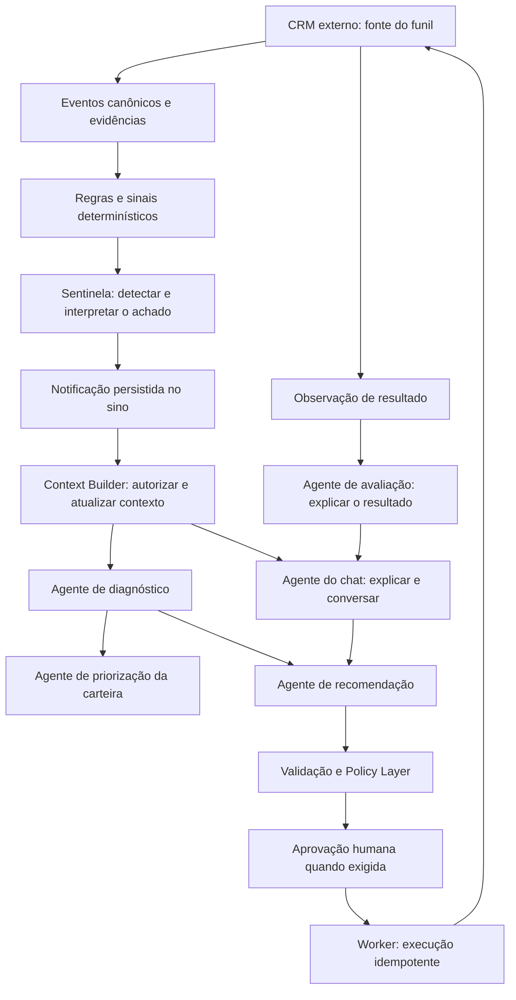

# ARES — plano de evolução da inteligência e dos agentes

Data: 07/10/2026. Base inspecionada: commit `40bb8e5`.

**Status em 09/10/2026: fases 1–9 implementadas com validação local; a conclusão da fase 0 e a fase 10 permanecem pendentes. Avaliação semântica com modelos reais e homologação de CRM continuam abertas.** A evolução preserva o monólito modular, React/TypeScript, FastAPI, Supabase/PostgreSQL, Agno/OpenAI, CRMProvider, Event Journal, Policy Layer e auditoria. Os contratos foram registrados no capítulo oficial Agentes e ferramentas, seções 13.3–13.10. [Entrega da fase 1](agent-execution-phase1-2026-10-08.md) e [contexto confiável da fase 2](trusted-context-phase2-2026-10-08.md). [Entrega das fases 6 e 7](commercial-agents-phase6-7-2026-10-09.md). [Entrega das fases 8 e 9](memory-outcomes-phase8-9-2026-10-09.md).

## 1. Resultado esperado

O ARES deve observar a carteira, interpretar evidências, explicar riscos, sugerir prioridades e ações, acompanhar decisões e resultados e conversar com o usuário sobre essas informações. Cada responsabilidade de IA terá agente próprio; a comunicação acontecerá por contratos validados e pelo supervisor determinístico.

Fluxo principal:

As setas representam os fluxos possíveis, não uma sequência obrigatória de todos os agentes em toda solicitação. Um pedido simples deve usar somente o necessário. O supervisor controla a sequência e os limites; não transfere autorização para o LLM.

## 2. Base existente e lacunas confirmadas

| Camada        | Existe hoje                                                                                                 | Evolução necessária                                                                             |
| ------------- | ----------------------------------------------------------------------------------------------------------- | ----------------------------------------------------------------------------------------------- |
| Chat          | Agno/OpenAI, histórico restrito, busca estruturada, contexto limitado e referências                         | Abrir pelo achado do sino, delegar análise, ampliar perguntas e consultar métricas completas    |
| Recomendações | Follow-up Agent com triagem na mesma saída; reserva de custo; decisões auditadas                            | Separar triagem, diagnóstico e recomendação; geração proativa limitada                          |
| Radar         | Sinais, score e prioridade determinísticos                                                                  | Explicações e sugestões de foco por IA, mantendo cálculo e prioridade final validados pelo Core |
| Sentinelas    | Regras tipadas de SLA vencido, sem responsável e sem atualização; horários, intervalos, versões e auditoria | Critérios mais ricos, interpretação por IA e ciclo completo de notificações                     |
| Sino          | Consulta periódica de achados atuais; link para detalhe da oportunidade                                     | Estado pessoal de leitura, paginação, contexto seguro e abertura do chat                        |
| Workers       | Jobs, tentativas, processamento de eventos e varreduras                                                     | Execuções especializadas duráveis, repasses, cancelamento e limites de concorrência             |
| Memória       | Context Builder, snapshots, Journal e grafo operacional                                                     | Memória semântica de conteúdo aprovado, gestão de validade e recuperação híbrida                |
| Administração | Central Admin do provedor; licenças do tenant; orçamento e capacidades                                      | Catálogo de agentes, limites por rotina, consumo por cadeia e configuração operacional          |
| Segurança     | Autorização por empresa/carteira, limites de requisições e de IA, proteção de payloads                      | Estender os mesmos controles a cada contrato novo, sem regressões                               |

Fontes de implementação verificadas: `backend/src/ares/chat/`, `intelligence/`, `decision/`, `sentinels/`, `workers/`, `ai/`, `agents/` e `apps/web/src/features/sentinels/NotificationBell.tsx`.

Os testes e aceites anteriores são históricos; este plano não reexecutou o sistema nem confirma esses números como uma nova validação.

## 3. Regras de arquitetura e produto

- O CRM externo permanece autoridade sobre negócios, etapas e atividades. Negócio do CRM e oportunidade de intervenção ARES continuam distintos.
- Valores, contagens, prazos e comparações monetárias são calculados por código/SQL parametrizado; o LLM explica e propõe.
- Score de risco/atenção, prioridade de intervenção e atratividade comercial são conceitos separados. Nenhum deles vira automaticamente probabilidade de fechamento.
- O Context Builder reúne evidências autorizadas e publica um snapshot limitado, versionado, com fontes, frescor e cortes registrados.
- Agentes não leem memória diretamente, não executam SQL livre, não escolhem credenciais de CRM e não ampliam o escopo do usuário.
- Repasses entre agentes não concedem permissões adicionais. Jobs autônomos usam identidade de serviço com finalidade e escopo explícitos; respostas ao usuário são filtradas novamente.
- Uma resposta anterior ajuda a interpretar a conversa, mas não substitui fatos atuais. Explicações antigas continuam vinculadas ao snapshot original.
- O grafo operacional é derivado do Journal por código. Um LLM não escreve relações como fatos confirmados. Graphify do repositório é ferramenta de desenvolvimento, não memória de clientes.
- Modelos podem ser compartilhados entre agentes; prompts, schemas, ferramentas, orçamento e execuções são separados por responsabilidade.
- Nenhuma chamada de IA acontece sem orçamento reservado. Uma cadeia inteira também tem limite, para evitar multiplicar custos por delegação.
- A Policy Layer mantém a autorização. Na política atual, tarefa exige aprovação de gestor, nota pode ser permitida e mudança de etapa por IA é negada. Qualquer ampliação exige decisão de produto e política versionada.
- Alegações sobre resultado distinguem observação, associação, influência e incrementalidade comprovada. Não estimar causalidade ou receita recuperável como fato.
- Dados de CRM, documentos e mensagens são conteúdo não confiável. Instruções contidas neles não alteram prompts, permissões ou ferramentas.
- Falta de evidência, contexto parcial, dados antigos, orçamento esgotado e falha do modelo precisam aparecer de forma compreensível.

## 4. Divergência que precisa ser resolvida na fase 0

O capítulo oficial [Memória dos Agentes](https://app.notion.com/p/3c4e18aa7b0d81d8a333f16da0114c3f) define o Context Builder como único leitor de memória e proíbe recuperação direta pelos agentes. O chat atual expõe `get_context` e `search_opportunities` ao modelo. A página [Agentes e ferramentas](https://app.notion.com/p/3c7e18aa7b0d81cba5c3d6e7cce87585) também prevê ferramentas estreitas e allowlisted.

Registrar no Notion a distinção entre consulta comercial e leitura de memória, além dos limites do chat interativo. Proposta: o agente pode produzir uma intenção estruturada de consulta; o supervisor valida filtros, finalidade, orçamento e acesso; o Context Builder realiza a consulta/recuperação e materializa um novo snapshot. Agentes de diagnóstico e recomendação recebem snapshots fechados. A compatibilidade das ferramentas atuais do chat deve ser alinhada explicitamente, não tratada como autorização para acesso livre.

O teto oficial de snapshot é 2.500 tokens. O helper atual `bounded_context` usa orçamento conservador por bytes em uma projeção específica; esses limites não são equivalentes. A fase 2 deverá estabelecer um contrato único, com medição conservadora documentada e blocos de contexto previstos na fonte oficial. Reproduzir o snapshot permite reexecutar uma avaliação, mas não garante texto idêntico de um modelo generativo.

## 5. Catálogo de agentes proposto

| Agente                  | Responsabilidade                                              | Entrada                                        | Saída validada                                                          | Limite                                                                  |
| ----------------------- | ------------------------------------------------------------- | ---------------------------------------------- | ----------------------------------------------------------------------- | ----------------------------------------------------------------------- |
| Triagem                 | Classificar o tipo de demanda/achado e necessidade de análise | Pedido ou evento + snapshot                    | Categoria, urgência proposta, lacunas e próximo agente                  | Não decide nem altera o CRM                                             |
| Sentinela               | Interpretar os candidatos encontrados pela regra configurada  | Regra versionada + evidências                  | Achado explicado, evidências, limitações e necessidade de revisão       | Não inventa critérios fora da regra; detector objetivo funciona sem LLM |
| Diagnóstico             | Explicar risco e identificar lacunas ou hipóteses             | Snapshot de negócio/oportunidade               | Fatos, hipóteses identificadas, evidências e informações faltantes      | Não trata hipótese como causa comprovada                                |
| Priorização             | Sugerir onde concentrar esforço comercial                     | Carteira autorizada, critérios e diagnósticos  | Lista ordenada proposta, comparação e justificativa                     | Core valida universo, cálculos, restrições e prioridade final           |
| Analista comercial      | Explicar funil, tendências e gargalos                         | Métricas determinísticas e períodos completos  | Síntese, comparações e limites                                          | Não calcula totais sobre uma amostra nem inventa previsão               |
| Recomendação            | Propor próxima ação e alternativas                            | Diagnóstico + estado atual + ações disponíveis | Ação proposta, justificativa, alternativas, contraindicações e validade | Submete ao DecisionService e à Policy                                   |
| Follow-up               | Redigir a comunicação ou o conteúdo da tarefa/nota            | Ação selecionada + contexto e playbook         | Rascunho fiel e campos tipados                                          | Sem envio autônomo fora da política                                     |
| Chat                    | Conduzir a conversa e apresentar análises dos especialistas   | Pedido, histórico permitido e snapshots        | Resposta com fontes, limites e opções pertinentes                       | Não assume sucesso de ações sem recibo                                  |
| Avaliação de resultados | Explicar o que mudou após a intervenção                       | Estado anterior/posterior, execução e outcomes | Observação, associação, incerteza e feedback                            | Causalidade/valor incremental exigem método próprio                     |

O supervisor é um serviço determinístico que seleciona etapas permitidas. Não há necessidade inicial de um LLM adicional para supervisionar outros LLMs. Instâncias configuradas de sentinela são rotinas deste catálogo, não um modelo treinado diferente para cada regra.

## 6. Fases de implementação

### Fase 0 — contratos oficiais, escopo e baseline de avaliação

**Objetivo:** definir o produto que será aceito e resolver divergências antes de alterar os contratos.

- Registrar no Notion catálogo, fluxo sino → chat, critérios de prioridade, níveis de autonomia e limites de consulta/memória.
- Mapear os campos realmente disponíveis no CRM/FakeCRM e os requisitos que dependem de históricos ausentes.
- Separar critérios de valor, urgência, prazo, risco e atratividade; definir a resposta padrão para “melhor oportunidade” e quando pedir esclarecimento.
- Criar conjunto versionado de perguntas e cenários sintéticos em português: listagem, totais, comparação, continuidade, riscos, ações, explicação do sistema e recusas por acesso.
- Incluir perguntas ambíguas, resultados vazios, falta de moeda/valor, atualização de dados, indisponibilidade de CRM e tentativa de injeção de instruções.
- Rodar baseline do comportamento existente; classificar falhas de recuperação, interpretação, raciocínio, UI ou integração.
- Definir métricas de qualidade, latência, custo, frescor e carga esperada do piloto; qualquer número adotado é meta de aceite, não resultado já alcançado.

**Aceite:** fonte oficial alinhada; cenários reproduzíveis; lacunas e campos ausentes registrados; testes obrigatórios e metas aprovados no contrato de entrega.

**Dependência:** nenhuma. **Arquivos:** documentação oficial, `docs/`, testes de chat e contratos de inteligência.

### Fase 1 — execução especializada e comunicação durável

**Entregue em 08/10/2026:** catálogo, supervisor, contratos, repasses, fila com fencing, orçamento, cancelamento, recuperação e APIs autenticadas. A rotina inicial contém dois agentes de contexto e começa desativada. Sua ativação exige administrador da empresa, contrato válido e duas capacidades de rotina disponíveis. Esta entrega não ativa ainda o fluxo sentinela → sino → chat. Detalhes no [relatório da fase 1](agent-execution-phase1-2026-10-08.md).

**Objetivo:** cada agente ter identidade, contrato e execução rastreável, compartilhando a infraestrutura existente.

- Criar catálogo versionado de definição, objetivo, prompt, schema de entrada/saída, modelo permitido, ferramentas e autonomia.
- Implementar serviço comum de execução sobre Agno/OpenAI; preservar `agent_runs`, ledger e guards existentes em vez de criar contabilidade paralela.
- Implementar contratos de solicitação e resultado, com `parent_run_id`, raiz de correlação e versão de schema.
- Estender a fila PostgreSQL para os novos tipos de jobs, claim concorrente, lease/heartbeat, timeout, retries limitados e recuperação após reinício.
- Persistir repasses e checkpoints; uma execução abandonada deve ser detectável e retomável ou encerrada com motivo.
- Controlar orçamento por run e cadeia, profundidade de delegação, número de passos e concorrência por empresa; impedir ciclos entre agentes.
- Implementar cancelamento e distinguir falha recuperável, rejeição de acesso, quota, saída inválida e modo degradado.
- Revalidar empresa, papel, contrato e capacidade na entrada e antes de cada etapa sensível.
- Definir a contagem de `agent_slots`: rotina ativa distinta, não mensagens, execuções ou agentes auxiliares invisíveis. Isso precisa ser consistente com planos e cobrança.

**Aceite:** uma cadeia sintética com dois agentes fica rastreável; repetição/reinício não duplica efeitos; quota e revogação bloqueiam a próxima etapa; loop e timeout terminam de forma controlada.

**Dependência:** fase 0. **Módulos:** `agents`, `ai`, `workers`, `provider`, migrations e testes PostgreSQL.

### Fase 2 — contexto confiável, consulta comercial e métricas completas

**Entregue em 08/10/2026:** consultas tipadas, agregados completos do espelho por moeda/etapa, Context Builder compartilhado, snapshots por autor/finalidade, orçamento conservador de 2.500 tokens, cache por versão e reconsulta de referências da conversa. Chat recebe contexto fechado e responde métricas sem modelo. Cobertura do CRM continua explicitamente não confirmada; snapshots legados de intervenções são preservados. [Entrega, testes e limites](trusted-context-phase2-2026-10-08.md).

**Objetivo:** todos os agentes analisar a mesma evidência autorizada e atual, sem confundir amostra com carteira completa.

- Consolidar Context Builder para negócio, oportunidade ARES, carteira, regra de sentinela e intervenção.
- Implementar intenções tipadas de consulta: filtros canônicos, ordenação, período, moeda, responsáveis e campos retornados; sem SQL do modelo.
- Adicionar ferramentas internas de agregação para contagens, somas por moeda, distribuição por etapa, prazos e mudanças no período.
- Usar consultas agregadas no banco para totais, com escopo de carteira do vendedor e da empresa para papéis autorizados.
- Distinguir completude da consulta no espelho de completude da sincronização do CRM; registrar watermark/frescor, páginas, limites e indisponibilidade.
- Reconciliar identidades por `tenant_id`, `connection_id` e ID externo. Não fundir homônimos de conexões diferentes.
- Materializar snapshots com finalidade, hash, fontes, referências, período, autorizações aplicadas, validade, token budget e indicação de truncamento.
- Separar histórico conversacional de fatos correntes; invalidar/reconsultar referências alteradas ou inacessíveis.
- Implementar cache apenas com chave de empresa, acesso, finalidade e versão dos dados; nunca compartilhar carteira por similaridade de pergunta.
- Validar qualidade de dados por código e declarar campos ausentes. IA pode explicar a lacuna, mas não preenchê-la como fato.

**Aceite:** perguntas sobre a carteira inteira retornam os mesmos números da consulta de referência; fontes parciais são identificadas; moedas não são somadas sem regra; acesso revogado ou tenant trocado não reutiliza contexto antigo.

**Dependência:** fases 0–1. **Módulos:** `intelligence`, `chat/search`, `graph`, `integrations`, Context Builder e snapshots.

### Fase 3 — triagem e diagnóstico separados

**Entregue localmente em 08/10/2026, opt-in por empresa.** [Implementação, ativação e evidências](specialist-analysis-phase3-2026-10-08.md). Atualização de análise é solicitada pelo usuário; disparo proativo permanece nas fases seguintes. Avaliação de qualidade com modelo real ainda depende da fase 0.

**Objetivo:** transformar dados e sinais em uma análise explicável antes de escolher a ação.

- Separar `triage` da saída combinada de `RecommendationModelFactory`, com adaptação versionada para recomendações e relatórios históricos.
- Implementar agente de triagem para classificação e encaminhamento, sem confundir urgência proposta com score calculado.
- Implementar diagnóstico: situação atual, sinais relevantes, hipóteses explícitas, evidências favoráveis/contrárias e dados faltantes.
- Validar que IDs, números, datas e evidências da saída existem no snapshot; saídas inválidas não alimentam decisão.
- Registrar validade e hash de origem; refazer análise após mudanças relevantes, sem regerar tudo a cada evento irrelevante.
- Introduzir a evolução por feature flags de empresa; preservar comportamento anterior como fallback identificado.

**Aceite:** cada responsabilidade produz `agent_run` próprio; o usuário entende por que uma oportunidade exige atenção; hipótese não é apresentada como fato; falha do diagnóstico não derruba o Radar.

**Dependência:** fases 1–2. **Módulos:** `decision/model_factory`, `model_output`, `intelligence`, catálogo de agentes e detalhe da oportunidade.

### Fase 4 — sentinelas configuráveis e notificações completas

**Entregue localmente em 08/10/2026.** [Implementação e evidências](sentinel-notifications-phase4-2026-10-08.md). Interpretação por IA opt-in; qualidade com modelo real ainda depende do piloto. Regras em linguagem natural eram opcionais e não foram incluídas. A abertura contextual do chat permanece na fase 5.

**Objetivo:** uma regra configurada executar, encontrar o que foi pedido e salvar um achado útil no sino.

- Preservar cards de regras e CRUD existentes; ampliar configuração com critérios tipados de etapa, carteira, valor/moeda, tipo de risco e janela temporal, conforme os dados disponíveis.
- Adicionar seleção de dias, janela de execução, horários específicos ou frequência diária e timezone; normalizar configurações e evitar combinações ambíguas.
- Mostrar resumo legível, próxima execução, última execução, resultado, falha, pausa e capacidade do plano.
- Opcionalmente interpretar a descrição em linguagem natural como rascunho de regra; mostrar os critérios para confirmação do admin. Nunca aceitar SQL livre.
- Fazer o detector determinístico selecionar candidatos com consultas parametrizadas; chamar o agente Sentinela somente para interpretação prevista na regra e dentro do orçamento.
- Persistir o achado objetivo mesmo se a IA falhar, indicando resumo pendente ou modo degradado.
- Salvar regra/versão, motivo, evidências, snapshot, estado observado, datas, severidade validada e runs relacionados.
- Implementar ciclo de achado aberto/atualizado/resolvido/superado e deduplicação por regra, entidade e condição; cooldown não pode esconder mudança relevante.
- Separar achado compartilhado de estado pessoal da notificação: não lida, lida, arquivada. Ler não resolve o risco.
- Paginar a caixa, calcular contador de não lidas com o mesmo escopo e tratar reassignment/revogação de acesso.
- Implementar inspeção e teste de regra sem efeitos no CRM; definir se execução manual consome quota/capacidade.

**Aceite:** regra criada → execução → achado → sino; execução repetida não gera spam; horários e dias funcionam no fuso; falha de IA preserva o achado; vendedor só vê notificações da carteira autorizada.

**Dependência:** fases 1–3. **Módulos:** `sentinels`, `workers`, `SentinelsPage`, `NotificationBell`, API e migrations.

### Fase 5 — sino → chat e conversa com especialistas

**Entregue localmente em 08/10/2026.** [Implementação e evidências](finding-chat-phase5-2026-10-08.md). Abertura objetiva idempotente, leitura atual, continuidade, histórico paginado e feedback pessoal. Diagnóstico reutiliza o runtime da fase 3; agentes proativos de priorização/recomendação continuam nas fases 6–7.

**Objetivo:** abrir uma notificação e já receber a explicação contextual, podendo continuar a conversa.

- Implementar endpoint que recebe apenas o ID do achado, revalida acesso e produz a abertura da conversa no servidor. O navegador não fornece evidências como verdade.
- Usar contexto original para explicar a detecção e contexto atualizado para orientar decisões; mostrar se o risco já foi resolvido ou mudou.
- Criar/retomar thread vinculada ao achado, com abertura idempotente; duplo clique e reconexão não devem duplicar análise ou cobrança.
- Abrir o chat a partir do sino; apresentar regra, resumo, negócio e indicação de origem em um bloco compacto, sem despejar JSON.
- Gerar a primeira explicação automaticamente depois do clique e permitir perguntas livres; carregar história paginada e preservar navegação de volta.
- Implementar encaminhamento controlado para diagnóstico, priorização, analista e recomendação, conforme intenção e finalidade autorizadas.
- Expandir intents: “dessas”, “por que essa”, “compare”, “qual risco”, “o que faço”, “quantas”, “qual valor”, “o que mudou” e ajuda sobre funções reais do produto.
- Manter mensagem enviada fora do composer imediatamente, Enter/Shift+Enter, três pontos lentos, estados discretos de consulta/análise e recuperação de stream interrompido.
- Propor perguntas de continuidade a partir de dados e ferramentas existentes; não sugerir ações impossíveis.
- Disponibilizar feedback útil/não útil e motivo, ligado à resposta, snapshot e runs; não usar feedback como mudança automática de policy.
- Testar Chrome e Firefox, teclado, mobile, scroll de conversa e ausência de overflow/erro de console.

**Aceite:** sino abre conversa contextual; usuário entende risco e próximos passos; duas perguntas de continuidade mantêm referências e atualizam fatos; notificação antiga não gera conselho baseado em dados superados.

**Dependência:** fases 2–4. **Módulos:** `chat`, `conversation`, `ChatPage`, `ChatEvidence`, sino e endpoints de handoff.

### Fase 6 — priorização de carteira e análise comercial proativa

**Objetivo:** responder “onde agir agora” com critério e evidência, inclusive sem pergunta individual por negócio.

- Implementar agente de Priorização separado do agente Analista comercial.
- Construir uma visão autorizada de carteira: negócios abertos, sinais, prazos, valor por moeda, responsáveis, cobertura e lacunas.
- Definir critérios e modos de análise: maior valor, maior urgência de intervenção, prazo próximo e atratividade com evidência disponível.
- Selecionar candidatos por consulta ordenada no banco, antes do limite de contexto; não escolher somente os oito registros mais recentes.
- Produzir ranking proposto e justificativas comparáveis; o Core valida IDs, critérios, cobertura e limitações antes de publicar.
- Manter score/priority determinísticos e apresentar leitura da IA como camada identificada. Um eventual uso na prioridade final exige política de composição versionada.
- Produzir briefing com foco, riscos e próximos passos em horário configurado; invalidar/recalcular somente por mudanças relevantes e conforme orçamento.
- Expor análise no Radar, Command Center e chat, com fonte, período, frescor, evidências e opção de abrir o negócio/achado.
- Comparações temporais dependem de histórico completo; previsões/probabilidade não entram sem base, método e avaliação próprios.

**Aceite:** carteira acima do limite de um snapshot é considerada na seleção; ranking tem critério explícito e fonte; não soma moedas diferentes; dashboard e chat mostram a mesma análise/versionamento quando usam o mesmo recorte.

**Dependência:** fases 2–3; integração com fase 5. **Módulos:** `intelligence`, `command_center`, Radar, catálogo e scheduler.

### Fase 7 — recomendação, follow-up e decisão integrada

**Objetivo:** transformar análise em proposta de ação que possa ser aprovada e executada com segurança.

- Implementar agente de Recomendação com ação principal, alternativas, riscos, contraindicações, dados ausentes e prazo de validade.
- Separar o agente de Follow-up para redigir a comunicação/tarefa/nota quando a ação proposta precisar desse conteúdo.
- Integrar ambos ao `DecisionService` existente, sem uma segunda fila de aprovações ou caminho de execução paralelo.
- Permitir geração proativa por evento/achado/prioridade, com cooldown, unicidade por contexto e limite por empresa; não gerar uma proposta duplicada a cada varredura.
- No chat, oferecer “Preparar recomendação” ou “Abrir aprovação” quando disponíveis. A conversa não constitui aprovação implícita.
- Antes de decidir/executar, revalidar snapshot, versão do negócio, identidade, papel, membership, contrato, quota, capability do CRM e policy vigente.
- Usar alvos resolvidos pelo backend e chaves idempotentes; persistir execução incerta e consultar o mesmo intento após timeout.
- Manter edição/rejeição auditadas; editar campos sensíveis exige nova validação. Não permitir ao modelo trocar destinatário ou negócio fora do contexto.
- Mostrar rascunho, pendência, aprovação, execução e recibo; só dizer “executado” após confirmação do provider.
- Novos canais de envio e novas ações entram apenas com adapter e autorização específicos. Não liberar mudança de etapa por IA nesta fase por conveniência.

**Aceite:** notificação → explicação → proposta → aprovação exigida → execução → Journal, com uma única ação real; versão alterada ou acesso revogado impede execução; timeout não produz duplicação.

**Dependência:** fases 1–3 e 5; fase 6 acrescenta disparo por carteira. **Módulos:** `decision`, policies, workers, connector, aprovações e chat.

### Fase 8 — RAG e memória comercial autorizada

**Entregue localmente em 09/10/2026:** documentos TXT/MD, versões, busca textual e vetorial autorizada, processamento externo por consentimento, quotas e citações no chat. [Detalhes e limites](memory-outcomes-phase8-9-2026-10-09.md).

**Objetivo:** enriquecer análises com playbooks e documentos confiáveis, sem trocar dados exatos por similaridade.

- Implementar gestão de documentos/playbooks por empresa: upload autorizado, versões, fonte, classificação, validade e estado de indexação.
- Definir formatos suportados, limite de tamanho, extração segura e quotas de armazenamento; OCR e formatos adicionais ficam explícitos como expansão.
- Implementar chunks em PostgreSQL/pgvector e busca textual em português, conforme a arquitetura oficial; modelo/dimensão de embedding têm versão e decisão de implantação.
- Fazer dedupe por hash e embedding na escrita; separar orçamento de indexação do de conversa; não reindexar conteúdo inalterado.
- Aplicar permissões por empresa, documento, carteira e finalidade antes da recuperação. Uma conexão privilegiada do backend não substitui predicados/RLS corretos.
- Recuperar de forma híbrida pelo Context Builder, com teto de chunks/tokens e referências de documento, trecho e versão. Sem acesso direto à memória por agentes.
- Não incorporar payload bruto, segredos, PII desnecessária ou conteúdo não confirmado como fatos. Resumo gerado continua derivado, com referência, não nova fonte oficial.
- Expirar fatos/documentos superados e aplicar retenção/exclusão a arquivos, chunks, embeddings e caches; preservação de auditoria deve minimizar dados pessoais.
- Mapear processamento externo e política de dados antes de indexar conteúdo de clientes; os testes usam conteúdo sintético. Não enviar o código do repositório para treinamento/indexação.
- Medir recuperação em conjunto rotulado, inclusive casos com documento parecido de outra empresa; avaliar `recall@5`, precisão e fidelidade das citações.
- Reranking por LLM só entra se métricas justificarem. Fine-tuning não é dependência deste plano.

**Aceite:** agente responde questão de playbook com trecho verificável; documento atualizado invalida versão antiga; remoção/revogação elimina recuperação; testes cruzados de empresa/carteira não retornam conteúdo indevido.

**Dependência:** fase 2; fases 3–7 usam a memória como enriquecimento posterior. **Módulos:** Context Builder, Storage, migrations, indexação em worker e configuração do tenant.

### Fase 9 — resultados, feedback e evolução controlada

**Entregue localmente em 09/10/2026:** agente avaliador separado, cadeia observada, feedback distinto dos fatos, episódios publicados manualmente, indicadores com denominadores e comparação de candidatos com revisão humana. Tempo de resposta do cliente permanece indisponível por falta de evento tipado. [Detalhes e limites](memory-outcomes-phase8-9-2026-10-09.md).

**Objetivo:** fechar o circuito de análise → ação → resultado e melhorar o produto por evidência.

- Implementar agente de Avaliação de resultados separado de recomendação e chat.
- Correlacionar estado antes, recomendação, decisão, execução, resposta do CRM, estado posterior e outcome observado.
- Definir janelas de observação, eventos tardios, intervenções concorrentes e situações em que o resultado ainda não pode ser medido.
- Calcular indicadores por código: tempo de resposta, resolução de risco, adesão, rejeição, falhas e mudanças observadas; sempre com denominador e período.
- Produzir explicação sobre o resultado, limitações e possíveis próximos passos; não transformar observação em causalidade.
- Registrar feedback do usuário e racional de rejeição sem promover opinião a fato confirmado.
- Alimentar memória somente com episódios autorizados e resultados verificáveis, vinculados às fontes e validade.
- Criar processo de comparação de prompts/modelos em dataset versionado; alterações passam por revisão, regressões e release, sem autoedição de políticas.
- Integrar resumo ao Impacto, detalhe da oportunidade e chat. `sale_value`, `ares_influenced_value` e `incremental_value` mantêm seus contratos.

**Aceite:** caso sintético permite reconstruir a cadeia completa; outcome ausente permanece pendente; explicação não atribui receita incremental sem método; regressões de qualidade bloqueiam uma nova versão.

**Dependência:** fase 7 e eventos de resultado; fase 8 enriquece memória, mas não bloqueia a primeira avaliação. **Módulos:** `impact`, Journal, outcomes, agentes e avaliações.

### Fase 10 — piloto hospedado e liberação gradual

**Objetivo:** provar o sistema integrado no ambiente de destino, sem confundir demo sintética com SaaS homologado.

- Instrumentar execução e cadeia: erros, retries, p95, custos, tokens, cortes de contexto, fila, atraso de varredura, notificações e uso por agente/tenant.
- Separar logs operacionais de evidências sensíveis; usar referências/redaction e controles de acesso.
- Ampliar Central Admin com catálogo e capacidades liberadas por empresa, validade, orçamento e limites de concorrência; manter dados comerciais fora da área do provedor.
- No ARES da empresa, expor configuração operacional permitida e gestão de usuários da própria empresa; o admin do tenant não altera planos globais.
- Publicar migrations aditivas, rollout por feature flags, procedimentos de rollback de aplicação e compatibilidade com runs históricos; não depender de excluir auditoria para reverter.
- Verificar Auth, redirects, expiração/revogação, MFA do operador, recuperação de conta, TLS, edge rate limit, backups, restauração, segredos e grants no ambiente hospedado.
- Executar testes unitários, integração PostgreSQL/pgTAP, contratos do provider, avaliações dos agentes, concorrência, carga prevista e UI ponta a ponta.
- Cobrir teclado, estados vazio/erro/degradado, streaming, mobile, Chrome/Firefox e console; gráficos críticos preservam alternativa acessível em tabela/lista.
- Rodar piloto pequeno com contas/papéis distintos e dois tenants, começando por leitura e depois intervenções autorizadas.
- Documentar operação, resposta a incidentes, encerramento de empresa, exportação/retencão/exclusão, versionamento e responsabilidades no manual.

**Aceite:** smoke público da cadeia inteira, isolamento e quotas conferidos, restore ensaiado, alertas operacionais ativos e aceite explícito do piloto. Não declarar homologação de CRM real apenas com FakeCRM.

**Dependência:** fases correspondentes às funcionalidades liberadas e trilha CRM real para dados de cliente.

## 7. Trilha paralela — integração com CRM real

Essa trilha começa nas fases 0–2; não é necessário aguardar toda a IA para iniciá-la. Nenhuma etapa de código substitui acesso ao CRM de teste e homologação do cliente.

1. Escolher o primeiro CRM e levantar autenticação, objetos, paginação, capabilities, limites e webhook.
2. Implementar adapter do `CRMProvider`, segredos por conexão no backend e roteamento autenticado por empresa/conexão.
3. Mapear etapas e IDs, preservar campos customizados, responsáveis, moedas, timezone e semântica de exclusão/arquivamento.
4. Implementar carga inicial, cursores/checkpoints, webhooks assinados, deduplicação, retries e reconciliação; declarar cobertura histórica e frescor.
5. Homologar leitura com contagens e amostras de referência do CRM, incluindo remoções e mudanças de responsável.
6. Homologar tarefa/nota e demais ações permitidas, versões, idempotência e resultado incerto após timeout.
7. Testar duas empresas/conexões com IDs e nomes coincidentes, credenciais distintas e acesso cruzado negado.
8. Confirmar limites do provider, observabilidade, reautorização de conexão e runbook de recuperação.

Dependências externas: CRM escolhido, sandbox/conta de teste, credenciais autorizadas, permissões, documentação e aprovação das operações de teste. Até isso ocorrer, as fases podem ser demonstradas com dados sintéticos, com a limitação visível.

## 8. Contratos de dados e API a detalhar nas migrations

Os nomes abaixo são propostas de contrato, não tabelas/endpoints já existentes. Preferir evolução das estruturas atuais a duplicação.

| Contrato              | Conteúdo mínimo                                                                                        |
| --------------------- | ------------------------------------------------------------------------------------------------------ |
| Definição de agente   | Nome, versão, responsabilidade, prompt/schema hashes, ferramentas, modelo, timeout, steps e autonomia  |
| Pedido de análise     | Empresa autenticada, ator/serviço, finalidade, escopo resolvido, critério, contexto e versão           |
| Run e handoff         | Run pai/raiz, correlação, destinatário permitido, estado, timestamps, budget, idempotência e resultado |
| Resultado de agente   | Fatos/hipóteses separados, evidências, limitações, versão, validade e modo de geração                  |
| Snapshot              | Referências, estado, data de captura, cobertura, permissões, conteúdo/hash e cortes                    |
| Achado de sentinela   | Regra/versão, entidade, condição, estado, evidências, datas e análise vinculada                        |
| Estado de notificação | Achado, usuário, leitura/arquivamento; sem copiar toda a evidência para cada usuário                   |
| Thread contextual     | Usuário/empresa, escopo, achado de origem, mensagens, snapshots e runs relacionados                    |
| Análise de carteira   | Critério, população/recorte, período, moedas, watermark, ranking proposto e validação Core             |
| Documento/memória     | Empresa, acesso, origem, versão/hash, validade, classificação, chunks e status de indexação            |
| Feedback/avaliação    | Resposta/run, motivo, rótulo humano, dataset/versão, métricas e referências de outcome                 |

Operações propostas: solicitar análise; obter status/resultados; abrir chat por achado; listar/ler/arquivar notificações pessoais; testar regra; consultar briefing; preparar recomendação; gerir documentos autorizados. Todas exigem contratos tipados, paginação/limites quando aplicáveis, auditoria e autorização no servidor. Reutilizar a API de decisão atual para aprovação e execução.

## 9. Verificação e gates obrigatórios

| Área       | Casos que impedem liberação                                                                                                                        |
| ---------- | -------------------------------------------------------------------------------------------------------------------------------------------------- |
| Acesso     | Outro tenant/carteira, documento revogado, thread de outro usuário, papel/membership/contrato alterado, acesso direto à API                        |
| Fatos      | Valor/data/ID inventado, moeda agregada sem conversão, soma de amostra anunciada como total, dado antigo tratado como atual                        |
| Agentes    | Repasse amplia acesso, loop sem teto, saída inválida aceita, retries sem orçamento, contexto sem fonte                                             |
| Sentinelas | Regra não executa, condição diferente do configurado, horário incorreto, backlog perdido, duplicação contínua, leitura resolve risco indevidamente |
| Conversa   | Sino não abre contexto, referência perde o universo anterior, duplo clique cobra duas vezes, reconexão perde/duplica resposta                      |
| Ações      | Conversa executa sem policy, aprovação por papel incorreto, stale context, tarefa duplicada, timeout anunciado como sucesso                        |
| Resultados | Influência anunciada como incrementalidade, resultado pendente anunciado como ganho, feedback tratado como fato                                    |
| Operação   | Worker parado sem alerta/readiness, falta de backup/restore, chaves em cliente/log, implantação com grants incompatíveis                           |

Metas de qualidade, tempo e custo são definidas na fase 0 e medidas desde a fase 1. Casos críticos de segurança e execução têm tolerância zero de falha na suíte de aceite; passar a suíte não é certificação universal de segurança.

Antes de concluir mudanças: lint, tipos, testes relevantes e build. Mudanças visuais também exigem navegador/teclado/responsividade/console. Mudanças de código exigem `graphify update .` somente AST, sem upload de documentação. Strix continua adiado; não é requisito automático desta entrega.

## 10. Ordem, recortes e limites de entrega

| Entrega                       | Fases         | Valor demonstrável                                                             |
| ----------------------------- | ------------- | ------------------------------------------------------------------------------ |
| Base comum                    | 0–2           | Consultas e contexto consistentes; execuções separadas, auditadas e limitadas  |
| Primeiro circuito inteligente | 3–5           | Regra → achado → sino → explicação → conversa contextual                       |
| Foco e intervenção            | 6–7           | Priorização da carteira, análise comercial, ação proposta e execução governada |
| Conhecimento e resultados     | 8–9           | Playbooks citados e acompanhamento explicável da intervenção                   |
| Piloto operacional            | 10 + CRM real | Fluxo hospedado e homologado para a empresa piloto                             |

Dentro do primeiro circuito, antecipar a abertura do sino no chat com o contexto determinístico é possível depois das fases 1–2, antes de todos os diagnósticos estarem completos. Isso entrega utilidade cedo sem afirmar capacidades ainda pendentes.

Fase 8 pode avançar em paralelo ao acabamento de fases 6–7 depois da base de contexto, se houver documentos aprovados e capacidade de trabalho. Produção/CRM, operação e segurança são trilhas contínuas, não testes deixados para o último dia.

Não é responsável prometer todas essas fases na semana da apresentação sem estimar os tickets e confirmar dependências. O pacote de apresentação deve ser escolhido pelo recorte realmente validado. O plano não define datas fictícias; cada fase vira tickets de backend, banco, UI, testes, documentação e aceite, com tamanho estimado após fase 0.

## 11. Evoluções posteriores, com pré-requisitos

- **Conversation Intelligence:** agente separado para conversas/reuniões autorizadas; depende de canais, consentimento, ingestão e qualidade de transcrição. Resumos e sinais continuam vinculados à fonte.
- **Agente de qualidade de dados:** explicar inconsistências detectadas por código; correções no CRM exigem proposta e policy próprias.
- **Predição de conversão:** histórico suficiente, labels, validação temporal, calibração e monitoramento de drift. Não usar confiança declarada pelo LLM como probabilidade.
- **Next-best-action aprendido:** comparar ações e outcomes com contexto; testar ganho sem confundir viés de seleção com efeito da ação.
- **Incrementalidade:** método causal/protocolo de medição e dados adequados, não somente relatório por agente.
- **Canais externos e automação ampliada:** adapters, autorização, consentimento e policy de envio/custo por canal.
- **Fine-tuning:** somente se avaliações demonstrarem problema persistente de comportamento após melhorar contexto/prompts; dataset autorizado, holdout, disponibilidade do fornecedor e operação de modelos próprios devem ser definidos antes. Não é parte obrigatória do MVP.

## 12. Referências

- [ARES CRM MVP — fonte oficial](https://app.notion.com/p/3c0e18aa7b0d801d8898d2402fc737b3).
- [ARES Connect — requisitos atuais](https://app.notion.com/p/3c3e18aa7b0d81b68a0bff83ed7fe9df).
- [Memória dos Agentes — Context Builder, RAG, grafo e limites](https://app.notion.com/p/3c4e18aa7b0d81d8a333f16da0114c3f).
- [Agentes e ferramentas — contratos e autonomia](https://app.notion.com/p/3c7e18aa7b0d81cba5c3d6e7cce87585).
- [Supabase — RAG com permissões](https://supabase.com/docs/guides/ai/rag-with-permissions): recuperação vetorial também precisa respeitar RLS/acesso ao documento. A arquitetura ARES acrescenta tenant/carteira/finalidade ao exemplo genérico.
- [Agno — Teams](https://docs.agno.com/teams/overview): referência de capacidades; adoção de um Team não substitui supervisor, fila, policy ou autorização ARES.
- [Chat implementado e seus limites](chat-conversation-2026-10-06.md).
- [Reaproveitamento Argus e sentinelas](argus-ares-reuse.md).
- [Central Admin e tenancy](central-admin-tenancy.md): usar como registro histórico, pois partes descrevem estágio anterior às implementações atuais.
- [Hardening de segurança](security-hardening-2026-10-07.md) e [publicação da demonstração](presentation-release-2026-10-05.md).
